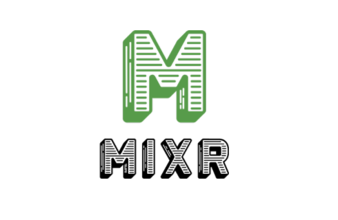

# Mixr - Cocktails on Demand
  [](https://lbesson.mit-license.org/)

  
  ## Description 
  The art of mixing cocktails is more than just the need for a buzz, it's the rewarding experience of combining the freshest ingredients with the kick of hand-crafted liqueurs to create consumable works of art. Or it's vodka and red bull yoloing into the night. Regardless of your style, with more folks spending time at home and out of bars, a replacement is needed for the mustachio aproned hipster delivering you the most “lit” cocktails to your table. Meet mixer, delivering your cocktail ideas via a MVC paradigm using MySQL, Express, and handlebars. The unique feature of Mixr is that you stock a virtual pantry with cocktail items you have laying around, then you can search the 600+ cocktails available via cocktailsdb.com based on what you actually have on hand. Not feeling that structured? That's fine, go for a bartender’s choice and Mixr will provide you with a random cocktail either of drinks you can make, or any drink of your choosing. Please enjoy responsibly, take care of each other, and relax with a craft cocktail. You've earned it
  
  ## Table of Contents
  * [Installation](#installation)
  * [Usage](#usage)
  * [Credits](#credits)
  * [License](#license)
  * [Contributions](#contributing)
  * [Tests](#tests)
  
  ## Installation 
  - ```git clone``` the repo. ```npm install``` to get the dependencies - expresss, express-handlebars, sequelize, mysql2, axios. ```mysql source``` the schema to instantiate the database, or run in mysql workbench.
  -  update confige/config.json to contain any relevant db changes such as name, password user etc. 
  - ```npm rum``` or ```node server.js``` to start the server running on localhost://3000
  
  ## Usage
  Check out the live version here XXX or With the server running, navigate to localhost://3000 in your browser. You will need a free account to log in. Fill up your pantry with ingridients using the add button. You can delete a pantry item by clicking the x next to the item. Use the search section to either search makeable drinks, close to makeable, or bartenders choice.If you like a cocktail, use the star icon to save it to your favorites list. Enjoy!
  
  ## Credits
  The dream team! Hilary Valencia-Walsh : hilaryvalenciawalsh | Chris Asmar : asmarcd | Timothy Phillips : unexpectedgoat | Robert Dalton : dadwanteat | Jonny Kemp : clubkemp  
  
  ## License
  MIT
  
  ## Contributing
  Reach out if you would like to contribute
  
  ## Tests
  none
  
  ## Questions
  Have quesitons about this repo? Please reach out on github or via email
  * kempj2.jk@gmail.com