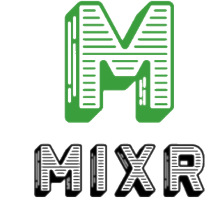

# Mixr - Cocktails on Demand
  [](https://lbesson.mit-license.org/)

  
  ## Description 
  The art of mixing cocktails is more than just the need for a buzz, it's the rewarding experience of combining the freshest ingredients with the kick of hand-crafted liqueurs to create consumable works of art. Or it's vodka and red bull yoloing into the night. Regardless of your style, with more folks spending time at home and out of bars, a replacement is needed for the mustachio aproned hipster delivering you the most “lit” cocktails to your table. Meet mixer, delivering your cocktail ideas via a MVC paradigm using MySQL + sequelize, Express, and handlebars. 
  
  The unique feature of Mixr is that you stock a virtual pantry with cocktail items you have laying around, then you can search the  cocktails available via based on what you actually have on hand. Not feeling that structured? That's fine, go for a bartender’s choice and Mixr will provide you with a random cocktail either of drinks you can make, or any drink of your choosing. Please enjoy responsibly, take care of each other, and relax with a craft cocktail. You've earned it
  
  ## Table of Contents
  * [Installation](#installation)
  * [Usage](#usage)
  * [Credits](#credits)
  * [License](#license)
  * [Contributions](#contributing)
  * [Tests](#tests)
  
  ## Installation 
  - ```git clone``` the repo. 
  - ```npm install``` to get the dependencies. 
  - ```mysql source``` the schema to instantiate the database, or run in mysql workbench.
  -  update confige/config.json to contain any relevant db changes such as name, password user etc.
  - create .env file at the root level containing SESSION_SECRET=password (password being a password you want to use for your session secret)
  -Upon first run, you will want to make sure the bottom of server.js file has ```force:true``` and ```seedModels()``` for your first sever start (this will build your models and seed the data)  
  - ```npm start``` or ```node server.js``` to start the server running on localhost://3000
  -At this time you should probably set ```force:false``` and comment out ```seedModels()```
  
  ## Usage
  Check out the live version here - [MixR](https://mixr-cocktail-app.herokuapp.com/) -  
  OR With the server running, navigate to localhost://3000 in your browser. 
  
  Enjoy browsing all cocktails, finding cocktails, or bartenders choice without a login. If you want to access the core function of the app, finding cocktails based on pantry items, you will need a free account to log in. 
  
  Once logged in, in "my bar" -> Fill up your pantry with ingridients using the the input field. You will get some suggestions based on ingredients we have in the master database. You can delete a pantry item by clicking the trash can next to the item. 
  
  Again in "my bar" - > Use the drinks I can make section to find the cocktails you have the ingredients to make right now. If you have something you like, use the + button on the cards to add it to "my cocktails", you'll find those saved in "my bar"-> "my cocktails"

  Not finding anything you like? How about creating it? In the create cocktail section, use the form to add a cocktail, make sure to include a photo to really make it pop! Start with one ingredient, but please use the + on the page to add more ingredient lines as needed. Once perfected, hit submit. That drink will be added to "my cocktails" and will be discoverable by other users as well.

  ## Credits
  The dream team! 
  - Hilary Valencia-Walsh |  [hilaryvalenciawalsh](https://github.com/hilaryvalenciawalsh) 
  - Chris Asmar | [asmarcd](https://github.com/asmarcd)  
  - Timothy Phillips | [unexpectedgoat] (https://github.com/UnexpectedGoat) 
  - Robert Dalton | [dadwanteat](https://github.com/dadwanteat)
  - Jonny Kemp  | [clubkemp](https://github.com/clubkemp)
  
  ## License
  MIT
  
  ## Contributing
  Reach out if you would like to contribute
  
  ## Tests
  none
  
  ## Questions
  Have quesitons about this repo? Please reach out to any of us via github or via email
  * kempj2.jk@gmail.com